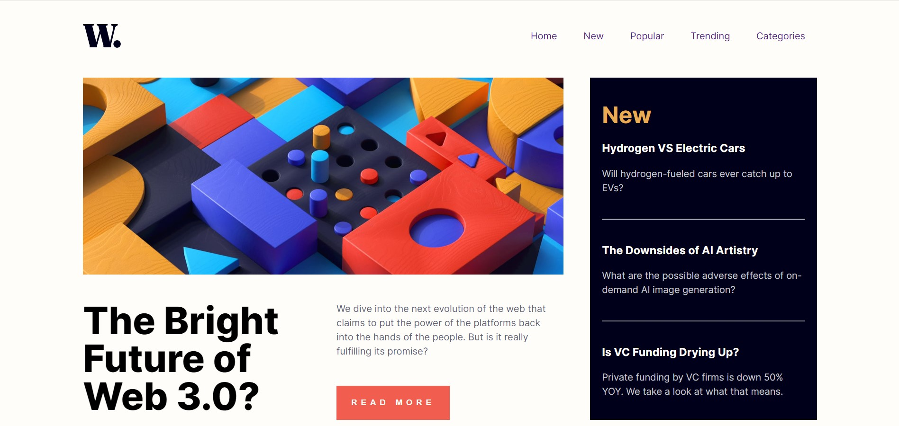

# Frontend Mentor - News homepage solution

This is a solution to the [News homepage challenge on Frontend Mentor](https://www.frontendmentor.io/challenges/news-homepage-H6SWTa1MFl). Frontend Mentor challenges help you improve your coding skills by building realistic projects. 

## Table of contents

- [Overview](#overview)
  - [The challenge](#the-challenge)
  - [Screenshot](#screenshot)
  - [Links](#links)
- [My process](#my-process)
  - [Built with](#built-with)
  - [What I learned](#what-i-learned)
  - [Continued development](#continued-development)


## Overview

### The challenge

Users should be able to:

- View the optimal layout for the interface depending on their device's screen size
- See hover and focus states for all interactive elements on the page

### Screenshot



### Links

- Solution URL: https://github.com/Vladmidir/news-homepage-main
- Live Site URL: https://vladmidir.github.io/news-homepage-main/index.html

### Built with

- Semantic HTML5 markup
- CSS custom properties
- CSS Grid

### What I learned
In this project, I learned how to use the CSS grid. I learned how to set the grid template and place elements within the grid.

```css
main {
    display: grid;
    grid-template-columns: 1fr 1fr 1fr;
    grid-template-rows: auto auto auto auto;
    gap: 35px 45px;
}

picture {
    grid-row: 1;
    grid-column: 1/3 ;
}
```

I have also learned how to modify HTML using Javascript.
```js
document.getElementById("close-menu").style.display = "block";
```

Learned how to make a sliding sidebar menu. 

```css
.side-menu {
    width: 0;
    height: 100%;
    transition: 0.5s;
    background-color: hsl(36, 100%, 99%);
}
```

We set initial width of the menu to 0. On click, we change the width to the chosen value. Transition property adds the sliding animation.

```js
function openMenu() {
      document.getElementById("close-menu").style.display = "block";
      document.getElementById("side-menu").style.width = "60%";
      document.getElementById("side-menu").style.paddingLeft = "20px";
    }
```

### Continued development

Here is the feedback I received from one of the mentors.

* use landmark elements - header and main on this challenge, and footer if you include attribution. All content should be in landmarks.
* only one nav, not two. Don’t repeat html for different screen sizes, just change existing markups layout with css
* you cannot have event listeners on non interactive elements. For a mobile nav toggle, there must be an accessibly named button with aria-expanded attribute on it directly before the list you are toggling. Often there will only be one button used for both open and close but you could have two buttons if you prefer
* don’t have an empty div. Create an overlay with a pseudo element and disable scroll when the nav is open on mobile 
* this challenge needs a visually hidden h1
* the featured article should be in an article element and have a h2
* new section should ideally be in a section or aside with aria-labelledby pointing to the id of the New heading
* inside each of the h3s you need to have anchor links. Think about how people would actually access these articles - they need to be able to click on them and navigate to the articles
* ideally the new section should have each of the articles in an unordered list
* the section at the bottom should have a visually hidden h2 eg other articles or recommended articles or popular articles, something like that
* I recommend that is also a section with aria-labelledby that heading ID
* the design shows each of the articles at the bottom are numbered. This gives a clear indication this section should include an ordered list to list these articles
* as with the other articles, these also need anchor links so there is a way to click through to the articles
* the numbers like 01 02 03 cannot be heading elements. That would make no sense semantically on a contents list for this page. Instead make them paragraphs. They could even be aria-hidden once you’ve added in the ordered list as each list item would be numbered already
* do not change inline styles with javascript. That’s not what it’s for. Use JavaScript to toggle attributes like aria-expanded and classes or other attributes of you like. Let css handle ALL styling

I may redo this challenge in the future, accounting for all the feedback.
